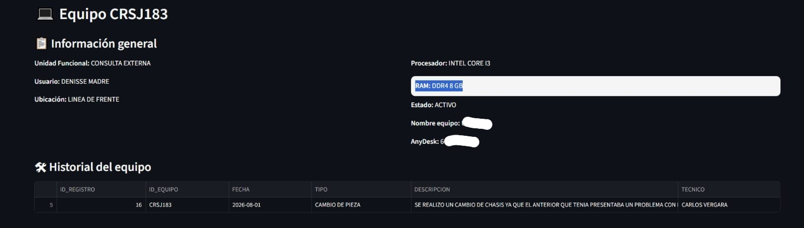
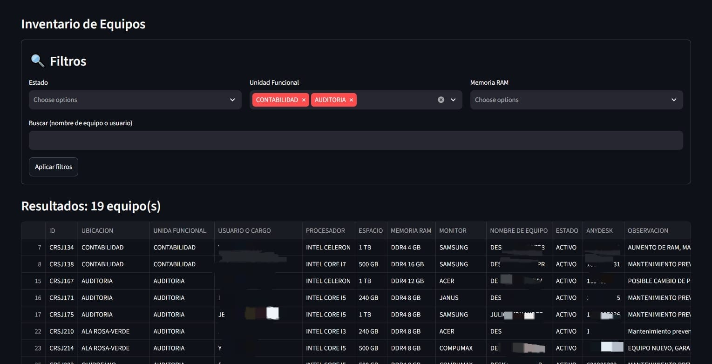
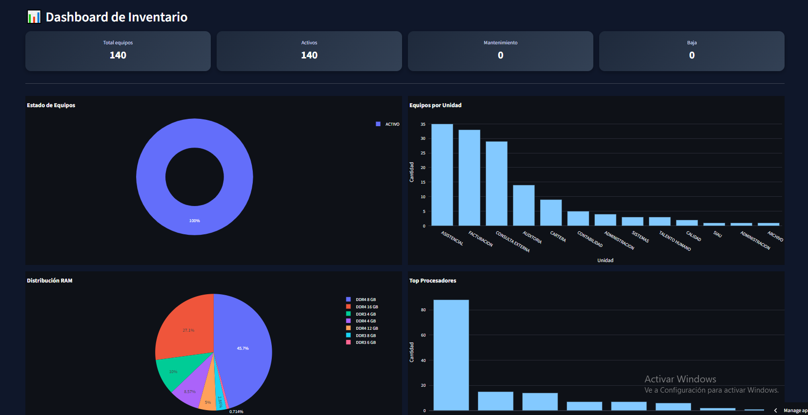

# Sistema de Inventario de Equipos de Cómputo

**Aplicación web para gestionar el parque informático de una clínica: 149 equipos, con etiquetas QR, historial de mantenimientos, tablero de indicadores y exportación a PDF.**


En producción desde 2026, en uso diario por el área de sistemas.

---

## El problema

El inventario vivía en un archivo de Excel dentro de una carpeta compartida. Los síntomas eran los de siempre: copias con nombres como `COMPUTADORES NEW1.xlsx`, dos personas editando a la vez y una sobreescribiendo a la otra, y ninguna forma de saber qué se le había hecho a un equipo el año pasado.

El caso que lo detonó: un técnico frente a un computador que no arranca no tiene manera de saber si ese mismo equipo ya falló antes, ni qué se le cambió. La información existía, pero no en el sitio ni en el momento en que hacía falta.

---

## La solución

Una aplicación web con base de datos real, accesible desde el celular, con una etiqueta QR pegada en cada equipo.

El técnico escanea el QR del computador y la aplicación abre directamente la ficha de ese equipo: características, estado y todo su historial de mantenimientos. Sin buscar, sin filtrar, sin abrir el Excel.

### Funcionalidades

| Módulo | Qué hace |
|---|---|
| **Inventario** | Listado con filtros combinados por estado, ubicación, unidad funcional y tipo. Exporta a CSV. |
| **Etiquetas QR** | Genera un QR por equipo que abre su ficha directamente. Se imprime y se pega en el chasis. |
| **Alta de equipos** | Formulario con validación de campos e identificador automático. |
| **Actualización y baja** | Edición de características y registro de bajas. |
| **Historial** | Bitácora de mantenimientos, cambios de componentes e incidencias, ligada a cada equipo: una historia clínica por computador. |
| **Tablero** | Indicadores y gráficos: distribución por estado, unidad funcional, procesador y memoria RAM. |
| **Informe PDF** | Reporte del parque completo, listo para entregar a dirección. |

---

## Capturas

**Al escanear el QR pegado en un equipo, el técnico ve esto en el celular:** las características de esa máquina y, debajo, todo lo que se le ha hecho. Una historia clínica por computador.



| Inventario y filtros | Tablero de indicadores |
|---|---|
|  |  |

---

## Arquitectura

```
Navegador / celular
        │
        ▼
   Streamlit  ── autenticación con hash scrypt, roles y control de intentos
        │
        │  clave secreta guardada del lado del servidor, nunca en el navegador
        ▼
   Supabase (PostgreSQL)
        │
        ├── equipos     inventario, con baja lógica
        └── historial   mantenimientos e incidencias
                        RLS activo, sin políticas para claves públicas
```

**Streamlit** para la interfaz: el área de sistemas necesitaba algo usable desde el celular sin instalar nada y sin mantener un frontend aparte.

**Supabase** para los datos: PostgreSQL administrado con Row Level Security, que resuelve de raíz el problema de edición concurrente que tenía el Excel.

El modelo de datos está en [`sql/schema.sql`](sql/schema.sql).

---

## Seguridad

Esta sección existe porque el proyecto tuvo fallos de seguridad reales y corregirlos fue parte del trabajo. Documentarlos me parece más útil que aparentar que no ocurrieron.

**Credenciales fuera del código.** Una versión anterior tenía la URL y la clave de Supabase escritas dentro de un script de migración, en un repositorio público. Se rotaron las claves, se revocó la firma anterior y las credenciales pasaron a `st.secrets`, que nunca toca el repositorio.

**Row Level Security con políticas restrictivas.** RLS estaba activo, pero con una política que permitía todas las operaciones a cualquiera. Eso convierte a RLS en decoración: la clave pública daba acceso completo a la base de datos, saltándose por completo el login de la aplicación. Se eliminaron esas políticas y la aplicación pasó a usar una clave secreta del lado del servidor.

**Contraseñas hasheadas.** El login comparaba usuario y contraseña en texto plano con `==`. Ahora usa scrypt con sal por usuario, comparación en tiempo constante y límite de intentos con espera creciente.

**Baja lógica en lugar de borrado.** Eliminar un equipo borraba también todo su historial, sin rastro ni forma de revertirlo. Ahora se marca como dado de baja y queda registrado quién lo hizo.

**Datos fuera del repositorio.** El inventario real describe la infraestructura de la clínica, incluidos identificadores de acceso remoto. No se publica.

---

## Estructura

```
app.py                    interfaz y navegación
services/
  auth.py                 autenticación, roles y permisos
  data_loader.py          lectura desde Supabase
  crud.py                 alta, edición y baja de equipos
  historial.py            bitácora de mantenimientos
  qr.py                   generación de etiquetas
  validations.py          validación de estructura
scripts/generar_hash.py   generador de credenciales
sql/schema.sql            modelo de datos y políticas
docs/img/                 capturas
```

**Stack:** Python · Streamlit · Supabase (PostgreSQL) · Plotly · ReportLab · qrcode · pandas

> Este es un sistema interno conectado a la base de datos de la clínica. El repositorio se publica como muestra de trabajo: no incluye datos ni credenciales, y no está pensado para desplegarse fuera de ese entorno.

---


**Carlos Andrés Vergara Jiménez** — Ingeniero de Sistemas, enfocado en analítica de datos.

[LinkedIn](https://www.linkedin.com/in/carlos-andr%C3%A9s-vergara-jim%C3%A9nez-06386b243/)
